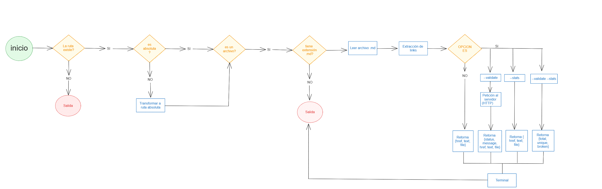

# Markdown Links

## Índice

* [1. Preámbulo](#1-preámbulo)
* [2. Resumen del proyecto](#2-resumen-del-proyecto)
* [3. Diagrama de flujo](#3-diagrama-de-flujo)
* [4. Modo de uso](#4-modo-de-uso)

***

## 1. Preámbulo

Markdown es un lenguaje sencillo, con una sintaxys muy resumida y fácil de recordar e interpretar, lo que redunda en velocidad de escritura y facilidad de mantenimiento del contenido. Es un lenguaje muy utilizado entre developers, los cuales lo aplican en plataformas que utilizan texto plano como por ejemplo Github. 

Este tipo de archivos normalmente continene **links** que se encuentran rotos o que ya no son válidos, perjudicando la información que se desea compartir. 

## 2. Resumen del proyecto

Este proyecto trata sobre la creación de una herramienta de línea de comando (CLI), el cual se ejecutará utilizando **Node.js**. Esta herramienta será capaz de analizar la ruta recibida y distinguir la extensión .md de los archivos que analizará,para luego hacer una verificación de enlaces válidos y "rotos" o no funcionales, para luego entregar esta información en estadísticas.

## 3. Diagrama de flujo

En este diagrama de flujo podrás visualizar y entender mejor el funcionamiento de esta herramienta.

## 4. Modo de uso

El usuario debe ingresar el siguiente ejecutable de la aplicación en la terminal:

`md-links <path-to-file> [options]`

##### Argumentos

* `path`: Ruta **absoluta** o **relativa** al **archivo** o **directorio**.
* `options`: Un objeto con **únicamente** la siguiente propiedad:
  - `--validate`: Realiza la validación de los links hallados en el archivo a través de una petición al servidor.
  - `-- stats`: Realiza las estadísticas de total de links encontrados, número de links únicos y rotos.

##### Valor de retorno

Si solo recibe como argumento la ruta del archivo, podrás ver en la terminal lo siguiente:

* `href`: URL encontrada.
* `text`: Texto que aparecía dentro del link (`<a>`).
* `file`: Ruta del archivo donde se encontró el link.

Si recibe la ruta del archivo y `--validate, podrás ver en la terminal :

* `href`: URL encontrada.
* `text`: Texto que aparecía dentro del link (`<a>`).
* `file`: Ruta del archivo donde se encontró el link.
* `status`: Código de respuesta HTTP.
* `ok`: Mensaje `fail` en caso de fallo u `ok` en caso de éxito.

Si recibe la ruta del archivo y `--stats, podrás ver en la terminal :

* `Total`: Total de links encontrados.
* `Unique`: Total de links unicos encontrados.

También si recibe la combinación de `--stats` y `--validate` junto con la ruta del archivo entregada, retornará en la terminal, lo siguiente:

* `Total`: Total de links encontrados.
* `Unique`: Total de links unicos encontrados.
* `Broken`: Total de links rotos o no válidos encontrados.

